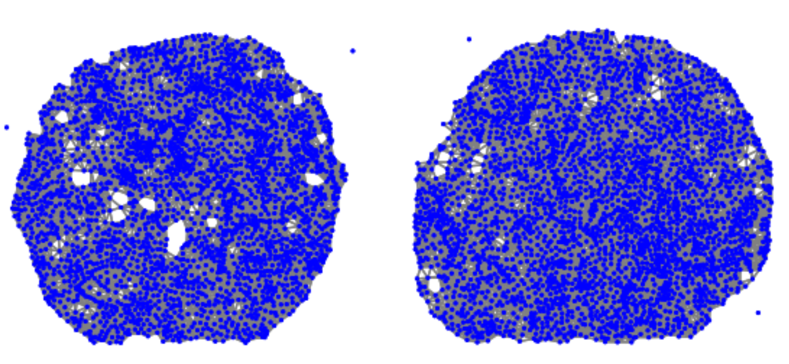
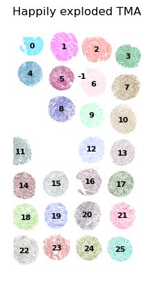

# TMAxplode 💣   




Small utility to separate tissue pieces or TMA cores in spatial transcriptomic measurements. Every separate tissue piece will receive a unique number. Optionally, identifies isolated pieces with less cells than specified to identify debris and damaged pieces.

## Usage

TMAxplode take as input an anndata object or a two dimensional numpy array indicating cell centroids. 

```
from tmaxplode import explode

adata = explode(adata,res_column="separated",radius=500,min_cells=50)

sc.pl.spatial(adata,color="separated",legend_loc="on data",legend_fontsize=8,frameon=False,spot_size=100,title="Happily exploded TMA")
```


alternatively:
```
res_vector = explode(centroid_array,radius=500,min_cells=50)
```
* res_column: Where the results will be saved in an anndata
* radius: Distance (in the units of the input cell centroids) at which cells are considered connected to each other. The default 500 seems to work well for Xenium TMAs
* min_cells: Connected tissue areas with less cells than this value will be labeled ```-1``` for quick filtering
* spatial_key Key in the anndata with coordinates, defaults to "spatial"
* connectivity_key optional Key in anndata with existing binary adjacency matrix, defaults to "spatial_connectivities" and calculates a new one if not found

## How it works

In the first step a binary adjacency matrix is built from the the provided centroids based on the specified radius.

Then an adjacency list is build for every node.

In the last step we iterate over all nodes starting a breadth first search (BFS) when an unvisited node is found to track down all components which are not connected.